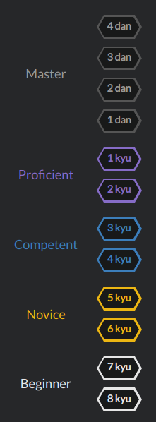

# Codewars

 This is how i completed tasks from codewars, dont copy if u want become smarter

In this repository i save copies of the katas i`ve completed. 

### My level:

### Leveling in Codewars:

## List of completed katas:

[Python](#python)

[SQL](#sql) 

[JS](#js) 

## Python:

### 3 kyu

[Alphabetic Anagrams](Python/Alphabetic%20Anagrams.py) - 3 kyu \
[Make a spiral](Python/Make%20a%20spiral.py) - 3 kyu

### 4 kyu

[Roman numerals helper](Python/romannumeralshelper.py) - 4 kyu \
[Don't give me five! Really!](Python/Don't%20give%20me%20five!%20Really!.py) - 4 kyu

### 5 kyu

[A Chain adding function](Python/A%20Chain%20adding%20function.py) - 5 kyu \
[Simple string expansion](Python/Simple%20string%20expansion.py) - 5 kyu \
[Pete, the baker](Python/Pete,%20the%20baker.py) - 5 kyu \
[Maximum subarray sum](Python/Maximum%20subarray%20sum.py) - 5 kyu \
[Human Readable Time](Python/Human%20Readable%20Time.py) - 5 kyu \
[Count IP Addresses](Python/Count%20IP%20Addresses.py) - 5 kyu \
[RGB To Hex Conversion](Python/RGB%20To%20Hex%20Conversion.py) - 5 kyu

### 6 kyu

[Your order, please](Python/Your%20order,%20please.py) - 6 kyu \
[Counting Duplicates](Python/Counting%20Duplicates.py) - 6 kyu \
[Stop gninnipS My sdroW!](Python/Stop%20gninnipS%20My%20sdroW!.py) 6 kyu \
[Create Phone Number](Python/Create%20Phone%20Number.py) - 6 kyu \
[Who likes it?](Python/Who%20likes%20it?.py) - 6 kyu \
[Alphabetized](Python/Alphabetized.py) - 6 kyu \
[Find The Parity Outlier](Python/Find%20The%20Parity%20Outlier.py) - 6 kyu \
[Even or Odd Accessor](Python/Even%20or%20Odd%20Accessor.py) - 6 kyu \
[Multiples of 3 or 5](Python/Multiples%20of%203%20or%205.py) - 6 kyu \
[Equal Sides Of An Array](Python/Equal%20Sides%20Of%20An%20Array.py) - 6 kyu \
[Persistent Bugger.](Python/Persistent%20Bugger..py) - 6 kyu

### 7 kyu

[Highest and Lowest](Python/Highest%20and%20Lowest.py) - 7 kyu \
[Sum of two lowest positive integers](Python/Sum%20of%20two%20lowest%20positive%20integers.py) - 7 kyu \
[You're a square!](Python/You're%20a%20square!.py) - 7 kyu \
[Exes and Ohs](Python/Exes%20and%20Ohs.py) - 7 kyu \
[Shortest Word](Python/Shortest%20Word.py) - 7 kyu \
[Isograms](Python/Isograms.py) - 7 kyu \
[Descending Order](Python/Descending%20Order.py) - 7 kyu \
[Disemvowel Trolls](Python/Disemvowel%20Trolls.py) - 7 kyu \
[List Filtering](Python/List%20Filtering.py) - 7 kyu \
[Vowel Count](Python/Vowel%20Count.py) - 7 kyu \
[The Pony Express](Python/The%20Pony%20Express.py) - 7 kyu \
[Alphabetical Addition](Python/Alphabetical%20Addition.py) - 7 kyu \
[Get the Middle Character](Python/Get%20the%20Middle%20Character.py) - 7 kyu \
[Credit Card Mask](Python/Credit%20Card%20Mask.py) - 7 kyu \
[Count the divisors of a number](Python/Count%20the%20divisors%20of%20a%20number.py) - 7 kyu \
[Mumbling](Python/Mumbling.py) - 7 kyu

### 8 kyu

[Sum without highest and lowest number](Python/Sum%20without%20highest%20and%20lowest%20number.py) - 8 kyu \
[Convert a Number to a String!](Python/Convert%20a%20Number%20to%20a%20S@github.comtring!.py) - 8 kyu \
[Opposite number](Python/Opposite%20number.py) - 8 kyu \@github.com
[Reversed Strings](Python/Reversed%20Strings.py) - 8 kyu \
[Return Negative](Python/Return%20Negative.py) - 8 kyu \
[Convert boolean values to strings 'Yes' or 'No'.](Python/Convert%20boolean%20values%20to%20strings%20'Yes'%20or%20'No'..py) - 8 kyu \
[Sum of positive](Python/Sum%20of%20positive.py) - 8 kyu \
[String repeat](Python/String%20repeat.py) - 8 kyu  \
[Remove First and Last Character](Python/Remove%20First%20and%20Last%20Character.py) - 8 kyu \
[Square(n) Sum](Python/Square(n)%20Sum.py) - 8 kyu \
[Multiply](Python/Multiply.py) - 8 kyu \
[Even or Odd](Python/Even%20or%20Odd.py) - 8 kyu \
[Convert a Boolean to a String.py](Python/Convert%20a%20Boolean%20to%20a%20String.py) - 8 kyu 

## SQL

### 5 kyu

[Count IP Addresses](SQL/Count%20IP%20Addresses.sql) - 5 kyu

### 8 kyu

[Even or Odd](SQL/Even%20or%20Odd.sql) - 8 kyu \
[Multiply](SQL/Multiply.sql) - 8 kyu 

## JS 

### 6 kyu

[Persistent Bugger.](JS/Persistent%20Bugger..js) - 6 kyu \
[Create Phone Number](JS/Create%20Phone%20Number.js) - 6 kyu

### 7 kyu

[Highest and Lowest](JS/Highest%20and%20Lowest.js) - 7 kyu \
[Descending Order](JS/Even%20or%20Odd.js) - 7 kyu \
[Sum of two lowest positive integers](JS/Sum%20of%20two%20lowest%20positive%20integers.js) - 7 kyu \
[Credit Card Mask](JS/Credit%20Card%20Mask.js) - 7 kyu

### 8 kyu

[Multiply](JS/Multiply.js) - 8 kyu \
[Even or Odd](JS/Even%20or%20Odd.js) - 8 kyu \
[Convert a Number to a String!](JS/Convert%20a%20Number%20to%20a%20String!.js) - 8 kyu \
[Return Negative](JS/Return%20Negative.js) - 8 kyu

.
...
.

.

Don`t copy as your own solution!!! thats will answer you how trully strong you are if you do that.

